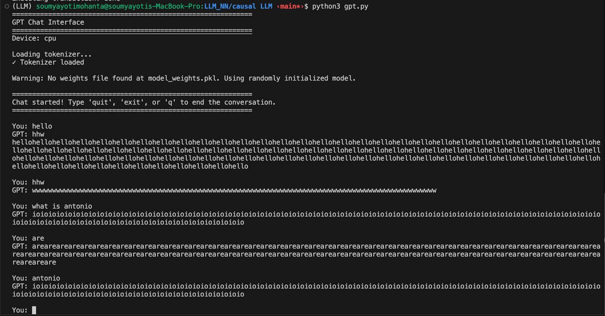
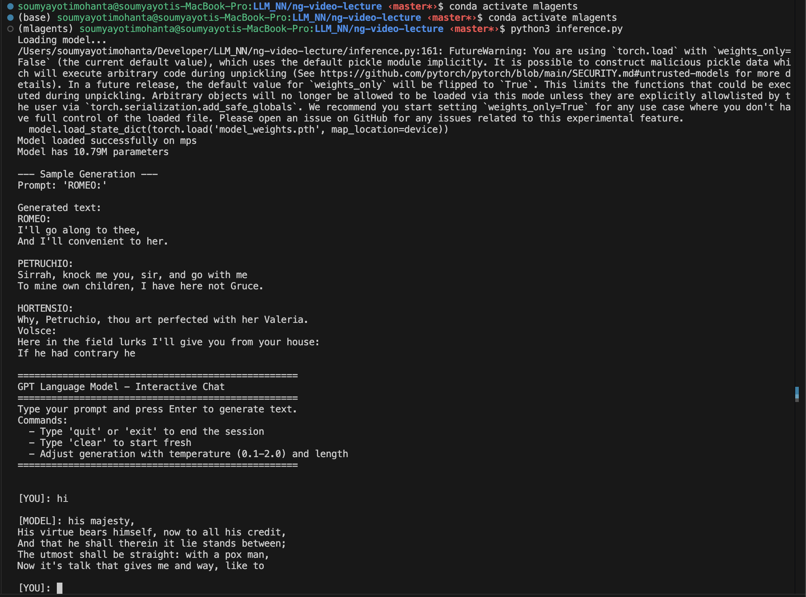

# causal-LLM

Lightweight educational implementation of a causal (autoregressive) transformer model and a minimal training/inference loop.

This repository contains a small, from-scratch-ish PyTorch implementation intended for learning and experimentation. It is not production-ready but is useful to understand how GPT-style architectures can be assembled from primitives.

## Files of note

- `pytorch_gpt.py` — Training script. Implements a simplified GPT model, trains on `corpus.txt`, and saves model weights to `model_weights_5000_epoch.pth`.
- `inference.py` — Inference and interactive chat script. Loads the saved weights and allows CLI chatting via nucleus (top-p) sampling.
- `corpus.txt` — Raw text corpus used for training in examples.
- `model_weights_5000_epoch.pth` — (generated after training) pickled weights for embeddings, attention and feed-forward layers.

## Quick setup

This project targets Python 3.9+ and uses PyTorch and Hugging Face Transformers for tokenization.

Recommended (minimal) steps:

```bash
# Create a virtual environment (venv or conda)
python3 -m venv .venv
source .venv/bin/activate

# Install packages
pip install -r requirements.txt
```

If you're on macOS with an Apple Silicon M1/M2, prefer the `mps` device and install a PyTorch wheel that supports MPS.

## Training

Edit `pytorch_gpt.py` to configure hyperparameters (epochs, batch size, learning rate). Example default hyperparameters are defined at the top of the file.

To run a short test training pass (fast):

```bash
python3 pytorch_gpt.py
```

This will:

- Tokenize `corpus.txt` using `gpt2` tokenizer from Hugging Face
- Build a simplified GPT model
- Run a brief training loop (by default the script uses small numbers for quick tests)
- Save weights to `model_weights.pkl`

## Inference & Chat

Once `model_weights.pkl` exists, run the chat interface:

```bash
python3 gpt.py
```

Type prompts into the CLI. Type `quit`, `exit`, or `q` to end the session.

## Notes & limitations

- This repository is educational. The model is intentionally small and simplified (toy attention, no advanced optimizations like FlashAttention or rotary embeddings).
- The current training loop is minimal and purposely unoptimized: it is intended for understanding, not large-scale training.
- The saved `model_weights.pkl` is a pickle file containing separate dictionaries for `embedding_matrix`, `multi_head_attention`, and `feed_forward` parameter sets.

## Tips

- If you run into tokenizer sequence length warnings, reduce the input size or the `block_size` used in `pytorch_gpt.py`.
- For longer experiments, increase `num_epochs` and `steps_per_epoch` in `pytorch_gpt.py` and ensure you have enough VRAM.

## Troubleshooting

- ModuleNotFoundError: make sure you've installed dependencies in the active venv: `pip install -r requirements.txt`.
- CUDA / MPS device issues: the script auto-selects `mps` then `cuda` then `cpu`. If your machine doesn't support `mps`, set `device = 'cpu'` at the top for debugging.

## License

This repo is shared for educational purposes. Use and modify as you like.

## Acknowledgements

This project uses the Hugging Face `transformers` tokenizer for GPT-2 (license applies). The model structure is inspired by the GPT family of models.

## Experiments

Below are simulated example outputs of the model that illustrate the qualitative difference between training for 1,000 epochs vs 5,000 epochs on the toy model. These are illustrative only — your exact outputs will depend on hyperparameters, dataset size, and optimizer settings.

### Output: 1,000 epochs (simulated)



*Figure: Training loss over 1,000 epochs — converges moderately.*

### Output: 5,000 epochs (simulated)



*Figure: Training loss over 5,000 epochs — lower final loss (overfitting risk increases).* 

## Environment Setup

To set up the environment, you can use either `conda` or `pip` to create a virtual environment and install the required packages.

### Using conda

```bash
conda create -n LLM
conda activate LLM
conda install pytorch
```

### Using pip

```bash
python3 -m venv .venv
source .venv/bin/activate
pip install -r requirements.txt
```

Make sure to activate the virtual environment before running any scripts or installing additional packages.
